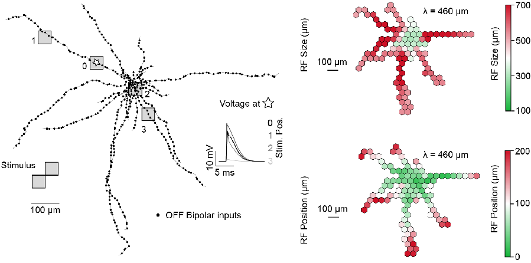
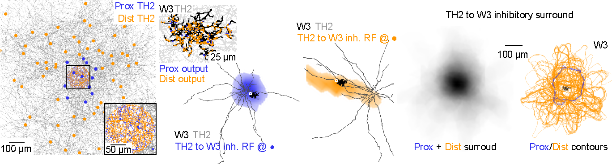
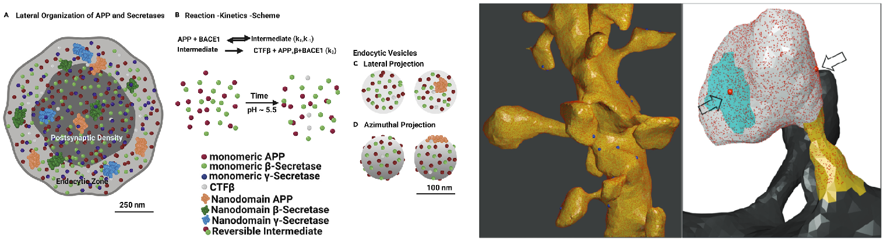
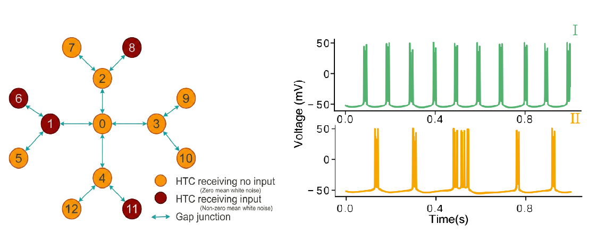

### Biophysical Compartmental Modeling of TH2 Receptive Fields

<figure>
  
  <figcaption style="margin-top: 15px; font-size: 0.9em;">
    We implemented anatomically constrained, biophysically realistic compartmental neuron models in NEURON to simulate dendritic integration and map functional receptive field geometries across the TH2 amacrine cell arbor.
  </figcaption>
</figure>

---

### Population-Level Modeling of TH2 Inhibitory Surrounds

<figure>
  
  <figcaption style="margin-top: 15px; font-size: 0.9em;">
    To link single-cell structure to circuit-level function, we developed a custom Python-based population simulation pipeline that embeds biophysically realistic neuron models into a dense retinal plexus to reveal how the bipartite architecture of TH2 amacrine cells constructs a daisy-shaped spatial filter.
  </figcaption>
</figure>

---

### 3D Stochastic Reaction-Diffusion Modeling of Amyloid Precursor Protein in Synapses

<figure>
  
  <figcaption style="margin-top: 15px; font-size: 0.9em;">
    Using Monte Carlo simulations within 3DEM hippocampal synapses reconstructed in Blender, we modeled the nanoscale reaction-diffusion kinetics of Amyloid Precursor Protein (APP) and secretases to investigate the biophysical mechanisms of amyloidogenic processing. This work was published in <a href="https://www.cell.com/iscience/fulltext/S2589-0042(20)31121-4" target="_blank">iScience</a> and <a href="https://pubs.rsc.org/en/content/articlehtml/2020/nr/d0nr00052c" target="_blank">Nanoscale</a>.
  </figcaption>
</figure>

---

### Phase-Relationships of High-Threshold Bursting Thalamocortical Neurons

<figure>
  
  <figcaption style="margin-top: 15px; font-size: 0.9em;">
    Using differential-equation-based neuron models in C++ and Python, we simulated a network of high-threshold thalamocortical (HTC) bursting neurons coupled via gap junctions to investigate their role in modulating Alpha oscillations in the brain. This work was presented at the Society for Neuroscience (SfN) Annual Meeting, 2017.
  </figcaption>
</figure>

---

